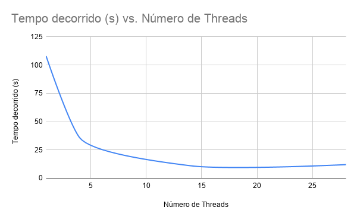

# riscv-multi-ql

Imperas QuantumLeap execution example.

## QuantumLeap

QuantumLeap is the parallel implementation of the Imperas OVP. It maps the simulated
cores to host cores with its own synchronization algorithm. No code or platform
changes are needed.

Imperas claims almost-linear performance enhancement.

## Test environment

The test has been made with 28 RISC-V RV32I processors executing independently 
one instance each of the Dhrystone application. The module description is in C
language with OP API and the parallelism options are changed via command line
arguments.

## Running the test:

No parallelism:
```
make run
```

Set the number of threads you wish to run:
```
make run THREADS=N
```

Set the number of threads to the maximum supported:
```
make run MAXTHREADS=1
```

## Check results

The `make run` command should output the elapsed time of the application.

## Test results

The image below show the results of the test running in a i9-7940X (14C/28T). The y-axis shows
the elapsed time in seconds, and the x-axis the number of threads:

<p align="center">
  
</p>